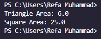

# Ujian Tengah Semester 
<br>Mata Kuliah 	: Praktikum Pemrograman Berorientasi Objek
<br> Nama            : Refa Muhammad
<br>NIM	            :	1227050113
<br>Jurusan		    :[Teknik Informatika](http://if.uinsgd.ac.id/) [UIN Sunan Gunung Djati Bandung](https://uinsgd.ac.id/) 

## Deskripsi Umum
For the final exam of the fourth semester of the Object-Oriented Programming Practicum course, you were asked to create a program that included all the PBO concepts that had been studied, including: 
1. Encapsulation
2. Inheritance
3. Polymorphism
4. Interface or Abstract
Made according to the criteria above and there are at least three classes in it

## Source Code
```
interface Shape {
    double calculateArea();
}

abstract class Polygon implements Shape {
    private int sides;

    public Polygon(int sides) {
        this.sides = sides;
    }

    public int getSides() {
        return sides;
    }

    public abstract String getType();
}

class Triangle extends Polygon {
    private double base;
    private double height;

    public Triangle(double base, double height) {
        super(3);
        this.base = base;
        this.height = height;
    }

    @Override
    public double calculateArea() {
        return 0.5 * base * height;
    }

    @Override
    public String getType() {
        return "Triangle";
    }
}

class Square extends Polygon {
    private double side;

    public Square(double side) {
        super(4);
        this.side = side;
    }

    @Override
    public double calculateArea() {
        return side * side;
    }

    @Override
    public String getType() {
        return "Square";
    }
}

public class Main {
    public static void main(String[] args) {
        Polygon triangle = new Triangle(3, 4);
        Polygon square = new Square(5);

        System.out.println(triangle.getType() + " Area: " + triangle.calculateArea());
        System.out.println(square.getType() + " Area: " + square.calculateArea());
    }
}

```

## Output


## Penjelasan
Program di atas merupakan contoh implementasi konsep OOP (Object-Oriented Programming) dalam Java menggunakan konsep-konsep seperti Interface, Abstract Class, Inheritance, dan Polymorphism. Berikut penjelasan singkatnya:

1. Interface Shape:
   - Merupakan sebuah kontrak yang menentukan bahwa kelas yang mengimplementasikan interface ini harus memiliki metode `calculateArea()` yang mengembalikan nilai bertipe `double`.

2. Abstract Class `Polygon`:
   - Merupakan kelas abstrak yang mengimplementasikan interface `Shape`.
   - Memiliki atribut `sides` yang menunjukkan jumlah sisi.
   - Memiliki constructor untuk menginisialisasi jumlah sisi.
   - Memiliki metode `getSides()` untuk mengembalikan jumlah sisi.
   - Memiliki metode abstrak `getType()` yang harus diimplementasikan oleh kelas turunannya.

3. Kelas `Triangle` dan `Square`
   - Merupakan kelas konkret yang mewarisi dari kelas abstrak `Polygon`.
   - `Triangle` memiliki atribut `base` dan `height` untuk menghitung luas segitiga.
   - `Square` memiliki atribut `side` untuk menghitung luas persegi.
   - Mengimplementasikan metode `calculateArea()` untuk menghitung luas sesuai dengan bentuknya masing-masing.
   - Mengimplementasikan metode `getType()` untuk mengembalikan jenis bentuknya.

4. Main Class
   - Di dalam method `main`, kita membuat objek `triangle` dan `square` dengan tipe data `Polygon` tetapi menginisialisasinya dengan kelas turunannya `Triangle` dan `Square`.
   - Hal ini menunjukkan konsep Polymorphism, di mana objek dapat berperilaku sesuai dengan tipe datanya (kelas induknya) meskipun diinisialisasi dengan kelas turunannya.

5. Output
   - Program mencetak jenis bentuk (Triangle/Square) beserta luasnya dengan memanggil metode `getType()` dan `calculateArea()` dari objek `triangle` dan `square`.
